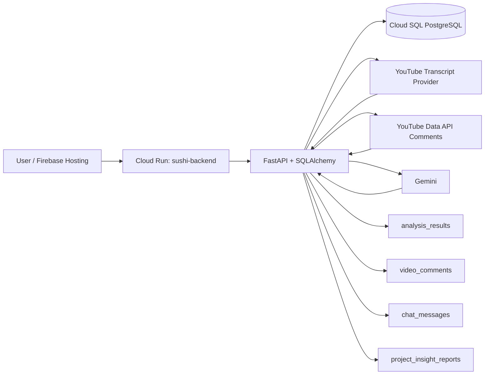
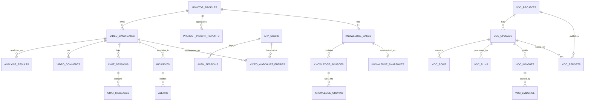

# Database Design

April 28 2026

This document explains how data is stored in the backend so new team members can understand the system quickly.

---

## TL;DR

- ORM: SQLAlchemy 2.x models under `app/models/`.
- Local DB default: SQLite (`sqlite:///./sushi.db`).
- Production DB: Cloud SQL PostgreSQL via `DATABASE_URL`.
- Tables are auto-created at startup (`Base.metadata.create_all`) and then patched by imperative migrations in `app/db_migrations.py`.
- Analysis transcripts are stored directly in `analysis_results.transcript_text` (full timestamped text), not in a separate transcript table.
- Many list/object fields are stored as JSON-encoded `TEXT` columns.

---

## System Data Flow

---

## Runtime Connection Model

1. App reads env vars from `Settings` (`DATABASE_URL`, `ENVIRONMENT`, etc.).
2. `get_db_engine()` builds SQLAlchemy engine and retries connection for Cloud SQL readiness.
3. Startup runs:
  - `Base.metadata.create_all(bind=engine)`
  - migration helpers in `app/db_migrations.py`
4. Every request gets a DB session from `get_db_session()`.

Production deploy config uses:

- `--add-cloudsql-instances sushi-d9036:asia-southeast1:sushi-d9036-instance`
- Cloud Run env var `DATABASE_URL` with the Unix socket DSN

The `DATABASE_URL` Secret Manager entry is not available in current production, so deployments should preserve or update the plain Cloud Run env var instead of using `--set-secrets DATABASE_URL=DATABASE_URL:latest`.

---

## Schema Conventions

- Base mixin adds `created_at` and `updated_at` to almost all tables.
- No Alembic. Schema evolution is handled by startup migration helpers.
- Several payload columns are JSON-in-text (encoded by `encode_json()`, decoded by `decode_json()`).
- Enums are used for queue state, analysis status, sentiment, risk, incident status, and knowledge source status.

Common JSON-in-text fields:

- `monitor_profiles.brand_keywords`
- `monitor_profiles.markets`
- `monitor_profiles.languages`
- `monitor_profiles.key_products`
- `analysis_results.evidence_json`
- `analysis_results.insights_json`
- `analysis_results.comment_highlights_json`
- `analysis_results.comment_lowlights_json`
- `chat_messages.citations_json`
- `project_insight_reports.*_json`
- `knowledge_chunks.metadata_json`

---

## Core ER Diagram

---

## Domain-by-Domain Table Map

### 1) Monitoring + Video Intake

- `monitor_profiles`: project-level monitoring settings.
- `video_candidates`: discovered/manual videos tied to a monitor profile.
  - unique `youtube_video_id`
  - queue state: `discovered`, `approved`, `rejected`
  - includes assignment fields (`assigned_user_id`, `assigned_by`, `assigned_at`)

### 2) Analysis + Comments + Insights

- `analysis_results`: canonical analysis output store.
  - unique index: `(video_candidate_id, analysis_version, language)`
  - stores transcript, summaries, sentiment/risk, evidence, insights, errors
- `video_comments`: comments fetched for each video and used in analysis/comment summaries.
- `project_insight_reports`: project-level rollups generated from latest completed video analyses.

### 3) Chat + Incident Workflow

- `chat_sessions`, `chat_messages`: per-video Q&A history and citations.
- `incidents`, `alerts`: escalation records and outbound/internal alerts.
- `audit_logs`: action trail (`actor`, `action`, `resource_type`, `resource_id`, `details`).

### 4) Auth + Personalization

- `app_users`: local app users.
- `auth_sessions`: hashed token sessions with expiry.
- `video_watchlist_entries`: user bookmarks for videos (unique per `video_candidate_id + user_id`).

### 5) Knowledge Base (RAG-like support)

- `knowledge_bases`: one or more KBs per monitor profile.
- `knowledge_sources`: source files/URLs and ingest status.
- `knowledge_chunks`: chunked text used for retrieval.
- `knowledge_snapshots`: consolidated markdown and source hash per KB.

### 6) VOC Subsystem

- `voc_projects`, `voc_uploads`, `voc_rows`, `voc_runs`
- `voc_insights`, `voc_evidence`, `voc_reports`
- `voc_skill_versions`, `voc_template_versions`

---

## How Transcript + Analysis Are Stored

This is the critical path for understanding analysis persistence.

1. `AnalysisService.analyze_video()` fetches transcript via `TranscriptService`.
2. `TranscriptService` normalizes transcript segments and builds one timestamped string (`full_text`).
3. Service creates/updates `analysis_results` row(s) by `(video_candidate_id, analysis_version, language)`.
4. On success:
  - writes transcript to `analysis_results.transcript_text`
  - writes summary fields, evidence, insights, risk/sentiment
5. On failure:
  - clears payload fields and sets `status=failed` + `error_message`
6. Chat and project insights read transcript from DB (`analysis_results.transcript_text`) instead of calling transcript API again.

Notes:

- Supported analysis languages are `en` and `zh-Hans`.
- The same video/version can therefore have separate rows per language.

---

## Lifecycle Example (End-to-End)

1. Create monitor profile -> `monitor_profiles`
2. Discover/add video -> `video_candidates`
3. Approve video -> `video_candidates.queue_state=approved`
4. Analyze video:
  - transcript/comments fetched externally
  - persisted to `analysis_results` and `video_comments`
5. Ask chat question:
  - context built from latest `analysis_results`
  - persisted to `chat_sessions` + `chat_messages`
6. Escalate incident:
  - create `incidents` + `alerts`
7. Refresh project insights:
  - aggregate latest completed analysis rows
  - write `project_insight_reports`

---

## Startup Migrations and Data Hygiene

Startup migration helpers currently ensure/repair:

- monitor profile `key_products` column
- analysis summary columns
- analysis `language` column + unique index
- analysis comment summary columns
- `video_comments` table
- video assignment columns
- default app users
- orphan/stale cleanup across dependent tables

Because this project uses imperative startup migrations, changes to models should also include corresponding migration helper updates when needed.

---

## Deletion / Cascade Strategy

- Most cascades are handled in application code, not DB-level cascade constraints.
- `MonitorRepository.delete()` manually deletes dependent records across alerts, incidents, chats, watchlist, comments, analysis, videos, project insights, and knowledge tables.
- Startup cleanup also removes orphan/stale rows to keep graph consistency.

---

## Quick Operational Checks

- Confirm DB target:
  - local: `DATABASE_URL=sqlite:///./sushi.db`
  - prod: PostgreSQL Cloud SQL socket DSN via Cloud Run env var
- Confirm Cloud Run wiring:
  - `--add-cloudsql-instances ...`
  - `DATABASE_URL` env var targets `sushi-d9036-database`
- Confirm hosting route:
  - Firebase rewrites all paths to Cloud Run service `sushi-backend` in `asia-southeast1`.

---

## When Updating This Design Doc

Update this file whenever you change:

- table names/columns/indexes
- transcript/analysis storage behavior
- migration strategy
- Cloud Run / Cloud SQL connection method
- JSON field contracts (shape or encoding)

