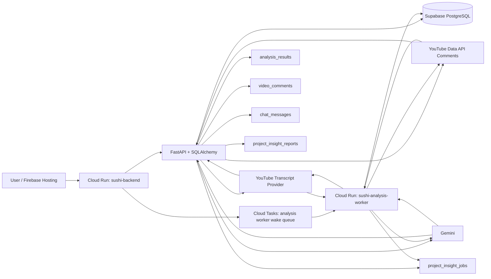
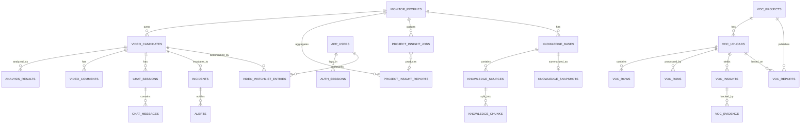

# Database Design

May 11 2026

This document explains how data is stored in the backend so new team members can understand the system quickly.

---

## TL;DR

- ORM: SQLAlchemy 2.x models under `app/models/`.
- Local DB default: SQLite (`sqlite:///./sushi.db`).
- Production DB: Supabase PostgreSQL via `DATABASE_URL`.
- Tables are auto-created at startup (`Base.metadata.create_all`) and then patched by imperative migrations in `app/db_migrations.py`.
- Analysis transcripts are stored directly in `analysis_results.transcript_text` (full timestamped text), not in a separate transcript table.
- Many list/object fields are stored as JSON-encoded `TEXT` columns.

---

## System Data Flow

---

## Runtime Connection Model

1. App reads env vars from `Settings` (`DATABASE_URL`, `ENVIRONMENT`, etc.).
2. `get_db_engine()` builds SQLAlchemy engine and retries connection for managed Postgres readiness.
3. Startup runs:
  - `Base.metadata.create_all(bind=engine)`
  - migration helpers in `app/db_migrations.py`
4. Every request gets a DB session from `get_db_session()`.

Production deploy config uses:

- No Cloud SQL attachment on Cloud Run.
- Cloud Run env var `DATABASE_URL` with the Supabase session pooler DSN.

The legacy Cloud SQL instance `sushi-d9036:asia-southeast1:sushi-d9036-instance` was stopped after the 2026-05-06 Supabase migration and should be treated as rollback-only infrastructure until deleted.

---

## Schema Conventions

- Base mixin adds `created_at` and `updated_at` to almost all tables.
- No Alembic. Schema evolution is handled by startup migration helpers.
- Several payload columns are JSON-in-text (encoded by `encode_json()`, decoded by `decode_json()`).
- Enums are used for queue state, analysis status, sentiment, risk, incident status, and knowledge source status.

Common JSON-in-text fields:

- `monitor_profiles.brand_keywords`
- `monitor_profiles.markets`
- `monitor_profiles.languages`
- `monitor_profiles.key_products`
- `analysis_results.evidence_json`
- `analysis_results.insights_json`
- `analysis_results.comment_highlights_json`
- `analysis_results.comment_lowlights_json`
- `chat_messages.citations_json`
- `project_insight_reports.*_json`
- `knowledge_chunks.metadata_json`

---

## Core ER Diagram

---

## Domain-by-Domain Table Map

### 1) Monitoring + Video Intake

- `monitor_profiles`: project-level monitoring settings owned by `owner_user_id`.
- `video_candidates`: discovered/manual videos tied to a monitor profile.
  - scoped unique index: `(monitor_profile_id, youtube_video_id)`
  - queue state: `discovered`, `approved`, `rejected`
  - includes assignment fields (`assigned_user_id`, `assigned_by`, `assigned_at`)

### 2) Analysis + Comments + Insights

- `analysis_results`: canonical analysis output store.
  - unique index: `(video_candidate_id, analysis_version, language, agent_settings_hash)`
  - stores transcript, summaries, sentiment/risk, evidence, insights, errors
- `video_comments`: comments fetched for each video and used in analysis/comment summaries.
  - unique index: `(video_candidate_id, youtube_comment_id)`
  - non-unique lookup index: `youtube_comment_id`
- `project_insight_reports`: project-level rollups generated from latest completed video analyses.
  - stores executive rollup metrics for portfolio reporting:
    - `sentiment_breakdown_json` (positive/neutral/negative counts)
    - `risk_breakdown_json` (low/medium/high/critical counts)
    - `reach_metrics_json` (reach-weighted impact metrics)
    - `top_negative_videos_json` (top 5 negative videos by reach)
- `project_insight_jobs`: durable async project insight refresh jobs.
  - state: `queued/running/completed/failed/cancelled`
  - one active job (`queued` or `running`) is allowed per `monitor_profile_id`
  - different projects can refresh insights concurrently, including across users
  - completed jobs link to the generated `project_insight_reports.id`
- `analysis_batches`: durable async batch runs for “Run all analysis” with aggregate progress counters.
- `analysis_batch_items`: per-video execution state for each batch (`queued/running/completed/failed/cancelled`), including attempts and failure message.
  - production processing is request-triggered: the backend inserts queued rows, enqueues a Cloud Task, and the worker claims work from these tables.

### 3) Chat + Incident Workflow

- `chat_sessions`, `chat_messages`: per-video Q&A history and citations.
- `incidents`, `alerts`: escalation records and outbound/internal alerts.
- `audit_logs`: action trail (`actor`, `action`, `resource_type`, `resource_id`, `details`).

### 4) Auth + Personalization

- `app_users`: local app users.
- `auth_sessions`: hashed token sessions with expiry.
- `agent_settings`: per-user analysis instructions stored in the database.
- `video_watchlist_entries`: user bookmarks for videos (unique per `video_candidate_id + user_id`).

### 5) Knowledge Base (RAG-like support)

- `knowledge_bases`: one or more KBs per monitor profile.
- `knowledge_sources`: source files/URLs and ingest status.
- `knowledge_chunks`: chunked text used for retrieval.
- `knowledge_snapshots`: consolidated markdown and source hash per KB.

### 6) VOC Subsystem

- `voc_projects`, `voc_uploads`, `voc_rows`, `voc_runs`
- `voc_insights`, `voc_evidence`, `voc_reports`
- `voc_skill_versions`, `voc_template_versions`

---

## How Transcript + Analysis Are Stored

This is the critical path for understanding analysis persistence.

1. `AnalysisService.analyze_video()` fetches transcript via `TranscriptService`.
2. `TranscriptService` normalizes transcript segments and builds one timestamped string (`full_text`).
3. Service resolves per-user agent settings from the monitor profile owner and creates/updates `analysis_results` row(s) by `(video_candidate_id, analysis_version, language, agent_settings_hash)`.
4. On success:
  - writes transcript to `analysis_results.transcript_text`
  - writes summary fields, evidence, insights, risk/sentiment
5. On failure:
  - clears payload fields and sets `status=failed` + `error_message`
6. Chat and project insights read transcript from DB (`analysis_results.transcript_text`) instead of calling transcript API again.

Notes:

- Supported analysis languages are `en` and `zh-Hans`.
- The same video/version can therefore have separate rows per language.
- Changing a user's agent settings changes the hash used for future analysis cache lookups. Existing analysis rows are not automatically reanalyzed; a new row is created the next time analysis is explicitly run for that video/settings hash.

---

## Lifecycle Example (End-to-End)

1. Create monitor profile -> `monitor_profiles`
2. Discover/add video -> `video_candidates`
3. Approve video -> `video_candidates.queue_state=approved`
4. Analyze video:
  - transcript/comments fetched externally
  - persisted to `analysis_results` and `video_comments`
5. Ask chat question:
  - context built from latest `analysis_results`
  - persisted to `chat_sessions` + `chat_messages`
6. Escalate incident:
  - create `incidents` + `alerts`
7. Refresh project insights:
  - insert or return active `project_insight_jobs` row for the selected project
  - Cloud Tasks wakes the analysis worker, or local/dev background fallback drains the queued job
  - aggregate latest completed analysis rows
  - write `project_insight_reports`
  - mark the job `completed` with `report_id`, or `failed` with `last_error`

---

## Startup Migrations and Data Hygiene

Startup migration helpers currently ensure/repair:

- monitor profile `key_products` column
- monitor profile `owner_user_id` column with legacy backfill to `Sushi_1`
- scoped video uniqueness by `(monitor_profile_id, youtube_video_id)`
- per-user `agent_settings` table
- analysis summary columns
- analysis `language` column
- analysis `agent_settings_hash` column + hash-aware unique index
- analysis comment summary columns
- analysis batch tables (`analysis_batches`, `analysis_batch_items`)
- project insight job table and one-active-job-per-project guard
- `video_comments` table
- video assignment columns
- project insight portfolio metrics columns
- default app users
- orphan/stale cleanup across dependent tables

Because this project uses imperative startup migrations, changes to models should also include corresponding migration helper updates when needed.

### What Changed (2026-05-22, async project insight jobs)
- What changed: Added `project_insight_jobs` with queued/running/completed/failed/cancelled status, creator tracking, error tracking, timestamps, optional `report_id`, and a partial unique guard that allows only one active insight job per project while allowing separate projects to run concurrently.
- Why it changed: Refreshing project insights can take a long time because it aggregates completed transcripts and calls Gemini. The previous synchronous request path blocked the UI and could make every project appear occupied by the same refresh state.
- Impact on existing data and compatibility: Additive schema change. Existing `project_insight_reports` rows remain valid and continue to serve current/history reads. New refresh requests create job rows and the worker writes reports asynchronously; startup cleanup removes orphaned job rows and clears invalid report links.

### What Changed (2026-05-14, analysis startup migration hotfix)
- What changed: Stopped the `analysis_results` language-column migration from recreating the obsolete unique index on `(video_candidate_id, analysis_version, language)`. The only intended analysis uniqueness is the hash-aware index on `(video_candidate_id, analysis_version, language, agent_settings_hash)`.
- Why it changed: Multi-account/per-user agent settings can legitimately store multiple analysis rows for the same video, version, and language when `agent_settings_hash` differs. Recreating the old unique index caused Cloud Run cold starts to fail when production already contained those valid rows.
- Impact on existing data and compatibility: Existing analysis rows remain valid. Startup migration now preserves distinct per-settings analysis rows and relies on the hash-aware unique index for future duplicate protection.

### What Changed (2026-05-11, account isolation and per-user agent settings)
- What changed: Added `monitor_profiles.owner_user_id`, moved runtime agent settings into the `agent_settings` table keyed by `user_id`, changed video uniqueness from global `youtube_video_id` to `(monitor_profile_id, youtube_video_id)`, and changed analysis cache uniqueness to include `agent_settings_hash`.
- Why it changed: Each account needs isolated project pages, isolated project/video access, and analysis output generated from that account owner's instructions.
- Impact on existing data and compatibility: Startup migrations backfill legacy monitor profiles to `Sushi_1`, mark old analysis rows with `agent_settings_hash='legacy'`, and allow the same YouTube video to be added to different projects/accounts. Existing shared root `AGENTS.md` is no longer runtime product settings; users start from the built-in default and can save their own DB-backed settings.

### What Changed (2026-05-13, request-triggered analysis worker)
- What changed: Analysis batch processing moved from an always-on Cloud Run polling worker to a request-triggered Cloud Tasks wake flow. The durable queue remains `analysis_batches` and `analysis_batch_items`; the worker now drains queued rows only when invoked.
- Why it changed: Reduce idle production compute cost for a low-volume internal tool while keeping user-visible batch progress and result persistence unchanged.
- Impact on existing data and compatibility: No schema migration or data rewrite is required. Existing queued/running/completed/failed/cancelled batch states remain valid; production must configure Cloud Tasks and the worker URL before relying on scale-to-zero processing.

### What Changed (2026-05-14, account-scoped video comments)
- What changed: Changed `video_comments` uniqueness from global `youtube_comment_id` to `(video_candidate_id, youtube_comment_id)` while keeping a non-unique lookup index on `youtube_comment_id`.
- Why it changed: Multi-account projects can now store separate `video_candidates` for the same YouTube video. A globally unique comment ID caused async Run All Analysis workers to fail when another account/project had already synced the same YouTube comment.
- Impact on existing data and compatibility: Existing comment rows remain valid. Startup migration drops the old global unique constraint/index and adds the scoped unique index. This may store the same YouTube comment once per account-scoped video candidate, which is compatible with the current per-video analysis flow and keeps the Cloud Tasks scale-to-zero worker deployment unchanged.

### What Changed (2026-05-11, documentation governance)
- What changed: Clarified that database structure, migrations, persistence behavior, production database target, transcript/analysis storage, and JSON contract changes must update this design document in the same change set.
- Why it changed: Make documentation upkeep explicit so the database design stays current as backend changes are made.
- Impact on existing data and compatibility: Documentation-only. No schema, migration, or persisted data behavior changed.

### What Changed (2026-04-30)
- What changed: Added four columns to `project_insight_reports`: `sentiment_breakdown_json`, `risk_breakdown_json`, `reach_metrics_json`, and `top_negative_videos_json`.
- Why it changed: Support project-wide executive reporting with sentiment/risk distributions and reach-weighted impact (including top negative videos by views).
- Impact on existing data and compatibility: Backward compatible. Existing rows default to empty JSON (`{}` / `[]`) and startup migration auto-adds missing columns without dropping or rewriting existing records.

### What Changed (2026-04-30, legacy retirement)
- What changed: Retired and dropped legacy `business_impact` columns from `analysis_results` and `project_insight_reports`. Removed all API/service/model references to `business_impact`; summary outputs now rely on headline/core insight/top risk trigger/immediate focus.
- Why it changed: `business_impact` was no longer part of the desired insights template and created duplicate or low-signal output relative to `immediate_focus`.
- Impact on existing data and compatibility: Startup migration now drops these columns if present. Historical values in `business_impact` are removed and are no longer returned by API responses. Existing insights behavior remains compatible via `immediate_focus` and recommendation fields.

### What Changed (2026-04-30, async analysis batches)
- What changed: Added new tables `analysis_batches` and `analysis_batch_items`, new indexes for batch lookup/progress, and APIs for create/status/items/cancel. Added a dedicated worker entrypoint (`app/workers/analysis_batch_worker.py`) that consumes queued batch items and executes `AnalysisService.analyze_video`.
- Why it changed: Replace in-browser sequential analysis loop with durable backend job execution so progress survives page refresh and supports production-safe long-running analysis.
- Impact on existing data and compatibility: Backward compatible for existing `analysis_results`/video data. New batch tables are additive; old single-video `/videos/{id}/analyze` API remains available. Deletion cleanup now also removes orphaned batch rows/items tied to deleted videos/projects.

### What Changed (2026-05-06, Supabase migration)
- What changed: Production database moved from Cloud SQL PostgreSQL to Supabase PostgreSQL using the Supabase session pooler. Cloud Run now uses the Supabase `DATABASE_URL`, has no Cloud SQL attachment, and the legacy Cloud SQL instance is stopped for rollback only.
- Why it changed: Current production traffic is very low, and Cloud SQL created an always-on fixed monthly cost that was too high for the project stage.
- Impact on existing data and compatibility: Schema shape is unchanged. Data was exported from Cloud SQL and imported into Supabase; key verification counts after migration were 28 tables, 2 monitor profiles, 42 video candidates, 84 analysis results, 1,157 video comments, 15 app users, and 75 audit logs.

---

## Deletion / Cascade Strategy

- Most cascades are handled in application code, not DB-level cascade constraints.
- `MonitorRepository.delete()` manually deletes dependent records across alerts, incidents, chats, watchlist, comments, analysis, videos, project insights, and knowledge tables.
- Startup cleanup also removes orphan/stale rows to keep graph consistency.

---

## Quick Operational Checks

- Confirm DB target:
  - local: `DATABASE_URL=sqlite:///./sushi.db`
  - prod: Supabase PostgreSQL session pooler DSN via Cloud Run env var
- Confirm Cloud Run wiring:
  - no Cloud SQL attachment
  - `DATABASE_URL` env var targets the Supabase pooler host
- Confirm hosting route:
  - Firebase rewrites all paths to Cloud Run service `sushi-backend` in `asia-southeast1`.

---

## When Updating This Design Doc

Update this file whenever you change:

- table names/columns/indexes
- transcript/analysis storage behavior
- migration strategy
- Cloud Run / production database connection method
- JSON field contracts (shape or encoding)

Every database design update should include a dated **What Changed** note that states what changed, why it changed, and the impact on existing data and compatibility.
