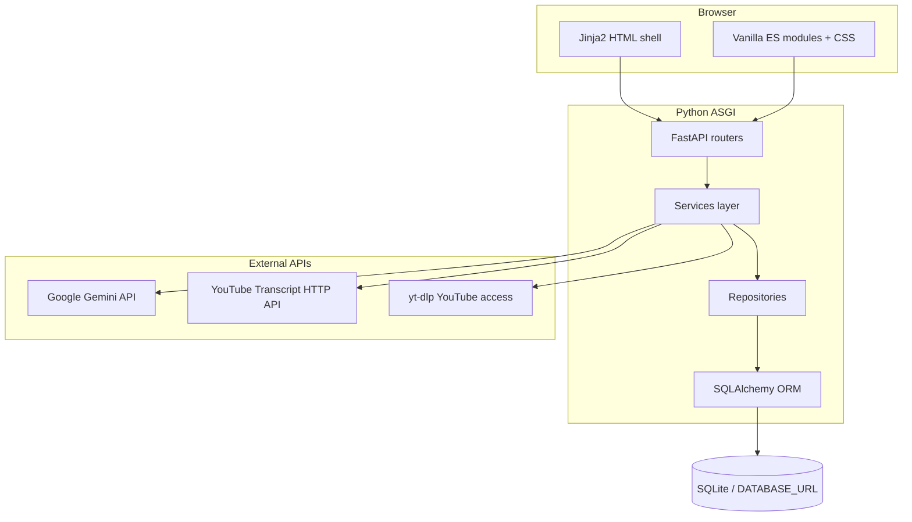

# Sushi — Technology Stack

**Document date:** 2026-04-01  
**Repository:** Influencer Video Intelligence (“Project Sushi”)  
**Scope:** Stack as implemented in the current codebase (not roadmap).

---

## 1. Summary

| Layer                              | Choices                                                                                       |
| ---------------------------------- | --------------------------------------------------------------------------------------------- |
| **Application server**             | Python 3, **FastAPI**, **Uvicorn** (ASGI)                                                     |
| **HTTP client (tests & services)** | **httpx**                                                                                     |
| **Persistence**                    | **SQLAlchemy 2.x ORM**, **SQLite** by default (`DATABASE_URL` overridable)                    |
| **Configuration**                  | **pydantic-settings**, `.env` via **python-dotenv**                                           |
| **Validation / APIs**              | **Pydantic** schemas                                                                          |
| **Web UI**                         | **Jinja2** templates, **vanilla ES modules** (`app/static/*.js`), CSS                         |
| **AI**                             | **Google Generative AI** (`google-generativeai`) — Gemini models for analysis and chat        |
| **YouTube / media**                | **yt-dlp** (discovery/metadata), **YouTube Transcript** HTTP API (`youtubetranscript.dev` v2) |
| **Testing**                        | **pytest**, in-memory SQLite fixtures                                                         |

There is **no** `package.json` / Node build step; front-end is served as static assets and ES modules.

---

## 2. Backend runtime

- **Framework:** FastAPI — routing, dependency-injected DB sessions, JSON/OpenAPI-style endpoints, HTML responses for shell routes.
- **ASGI server:** Uvicorn (typical deployment; not pinned in-repo beyond `requirements.txt` listing `uvicorn`).
- **Process model:** Single synchronous request path for most operations; long work is still request-scoped unless explicitly backgrounded (no separate worker/queue process in this repo).

**Entry:** `app/main.py` — mounts static files, registers routers, runs `Base.metadata.create_all` and lightweight SQL migrations on startup.

---

## 3. Data & persistence

- **ORM:** SQLAlchemy (`create_engine`, `sessionmaker`, `Session` per request via `get_db_session`).
- **Default database:** SQLite file `./sushi.db` (configurable with `DATABASE_URL`).
- **SQLite specifics:** `check_same_thread=False` when URL starts with `sqlite`.
- **Schema evolution:** `Base.metadata.create_all` plus imperative helpers in `app/db_migrations.py` (e.g. `ALTER TABLE` for new columns).

**Domain areas (illustrative):** monitor profiles, video candidates, analysis results, knowledge bases/chunks, incidents, VOC (voice-of-customer) uploads/runs/insights, agent settings, audit trails — all SQLAlchemy models under `app/models/`, repositories under `app/repositories/`.

---

## 4. HTTP API surface

Routers (prefixes/tags in code) include:

| Router                  | Role (high level)                                          |
| ----------------------- | ---------------------------------------------------------- |
| `health_router`         | Health checks                                              |
| `monitor_router`        | Monitor profiles / projects                                |
| `video_router`          | Video queue, discovery, analysis triggers, bulk operations |
| `chat_router`           | Chat over analysis context                                 |
| `incident_router`       | Incidents                                                  |
| `agent_settings_router` | Agent prompts/settings                                     |
| `knowledge_router`      | Knowledge base upload, chunks, activation                  |
| `voc_router`            | VOC CSV pipeline, runs, publishing gates                   |

**Multipart:** `python-multipart` for file uploads (knowledge, VOC CSV, etc.).

---

## 5. Services & integrations

| Integration           | Library / protocol                      | Purpose                                                                                               |
| --------------------- | --------------------------------------- | ----------------------------------------------------------------------------------------------------- |
| **Gemini**            | `google-generativeai`                   | Structured analysis output, chat; model names from env (`GEMINI_MODEL_ANALYSIS`, `GEMINI_MODEL_CHAT`) |
| **Transcripts**       | `httpx` → `YOUTUBE_TRANSCRIPT_BASE_URL` | Fetch/normalize transcript text for analysis                                                          |
| **YouTube discovery** | `yt_dlp`                                | Metadata / discovery paths in `youtube_discovery_service`                                             |
| **Knowledge**         | DB + token overlap ranking              | `KnowledgeRetrievalService` builds context strings for analysis/chat (no vector DB in-repo)           |

**Config:** Centralized in `app/config.py` (`Settings`): API keys, chunk limits, VOC policy thresholds, transcript retries/timeouts.

---

## 6. Front-end stack

- **HTML:** Jinja2 templates (`app/templates/index.html` — main SPA-like shell).
- **Styling:** `app/static/styles.css`; Google Fonts (Geist, Geist Mono) via CDN in template.
- **JavaScript:** ES modules — `main.js` orchestrates dashboard, queue, video detail, agent settings, knowledge settings, VOC (`voc.js`), shared `api-client.js`, `state.js`, `router-state.js`, etc.
- **No** React/Vue/Svelte bundler; browser loads `/static/*.js` directly.

---

## 7. Dependencies (`requirements.txt`)

Declared Python packages:

`fastapi`, `uvicorn`, `sqlalchemy`, `pydantic`, `pydantic-settings`, `python-dotenv`, `google-generativeai`, `youtube-search-python`, `yt-dlp`, `pytest`, `httpx`, `jinja2`, `python-multipart`

**Note:** `youtube-search-python` is listed but **no imports** were found in the repository at documentation time; treat as unused or reserved unless wired later.

---

## 8. Testing & quality

- **Runner:** pytest.
- **Style:** Primarily **unit** tests under `tests/unit/` with `conftest.py` providing in-memory SQLite and fixtures (`MonitorProfile`, etc.).
- **HTTP:** `httpx` used in app code (transcripts) and suitable for FastAPI `TestClient`-style tests where present.

**CI:** No `.github/workflows` or similar found in-repo at documentation time.

---

## 9. Architecture diagram (stack view)

---

## 10. Feature pipelines (concrete flows)

Each subsection lists the **code path** (router → service → IO) and what happens **synchronously** in the current app (no background workers).

### 10.1 Monitor profiles (“projects”)

| Step        | What runs                                                                                                                                               |
| ----------- | ------------------------------------------------------------------------------------------------------------------------------------------------------- |
| API         | `GET/POST/PUT/DELETE /monitor-profiles` → `MonitorRepository`                                                                                           |
| Persistence | `monitor_profiles` row: brand keywords, markets, languages, `key_products`, alert sensitivity, etc. (JSON columns via `encode_json` patterns elsewhere) |
| UI          | Front-end uses profile id in routes/state to scope videos, knowledge, VOC                                                                               |

**Pipeline:** CRUD only — no external calls.

---

### 10.2 Automated discovery (`POST /videos/discover`)

| Step | What runs                                                                                                                                                                      |
| ---- | ------------------------------------------------------------------------------------------------------------------------------------------------------------------------------ |
| 1    | `TriageService.discover_for_profile` loads profile; merges **brand keywords + key products** for monitoring terms                                                              |
| 2    | `YouTubeDiscoveryService.discover` → `discover_by_keywords`                                                                                                                    |
| 3    | If `ENABLE_MOCK_DISCOVERY` is **false**: `**yt_dlp`** `YoutubeDL` with `ytsearch{N}:{query}`, `extract_flat`, no download — builds `DiscoveredVideo` list from entries         |
| 4    | If **true**: deterministic **mock** seeds from `_seed_videos` (no network)                                                                                                     |
| 5    | Per hit: `RelevanceService.score(title, description, keywords)` — **substring match** on title/description vs keywords → `relevance_score` + human-readable `relevance_reason` |
| 6    | `VideoRepository.upsert_candidate` — **one YouTube id globally**: conflicts with another `monitor_profile_id` skip with error semantics in bulk paths                          |
| 7    | `AuditRepository.record` action `discover_videos`                                                                                                                              |

**External:** YouTube via **yt-dlp** (live) or none (mock).

---

### 10.3 Keyword search & bulk add (`POST /videos/search`, `POST /videos/bulk-add`)

| Path         | Behavior                                                                                                                                           |
| ------------ | -------------------------------------------------------------------------------------------------------------------------------------------------- |
| **Search**   | Same `discover_by_keywords` + relevance scoring; returns **preview** rows with `can_add` / `block_reason` if video already tied to another project |
| **Bulk add** | For each selected candidate, builds `DiscoveredVideo`, `_upsert_owned_video(..., raise_on_conflict=True)`; audit `bulk_add_candidates`             |

---

### 10.4 Manual add (`POST /videos/manual`)

| Step | What runs                                                                       |
| ---- | ------------------------------------------------------------------------------- |
| 1    | `extract_video_id` from URL → canonical `watch?v=` URL                          |
| 2    | `**fetch_oembed_metadata`** (YouTube oEmbed HTTP) for title/channel             |
| 3    | Relevance score vs profile keywords (description treated as title in code path) |
| 4    | `upsert_candidate` with `published_at` = now (UTC)                              |
| 5    | Audit `manual_video_added`                                                      |

**External:** YouTube **oEmbed** (not yt-dlp).

---

### 10.5 Queue: list, approve, delete (`GET /videos`, `POST /videos/{id}/approve`, `DELETE /videos/{id}`)

| Step    | What runs                                                                                                                                                     |
| ------- | ------------------------------------------------------------------------------------------------------------------------------------------------------------- |
| List    | `VideoRepository.list` with optional filters; response enriched with profile name, latest sentiment label, latest analysis status via `TriageService` helpers |
| Approve | `update_queue_state`; audit `approve_video` / `reject_video`                                                                                                  |
| Delete  | hard delete candidate; audit `delete_video`                                                                                                                   |

---

### 10.6 Video analysis (`POST /videos/{video_id}/analyze`, `GET /videos/{video_id}/analysis`)

#### Preconditions and fetch

| Step | What runs                                                                                                                                                                                                                                                                                                          |
| ---- | ------------------------------------------------------------------------------------------------------------------------------------------------------------------------------------------------------------------------------------------------------------------------------------------------------------------ |
| 0    | **Cache:** If `force_reanalyze` is false and a **completed** `analysis_results` row exists for `ANALYSIS_VERSION`, return it and audit `analysis_skipped_cached`                                                                                                                                                   |
| 1    | `GeminiClient.ensure_ready()` — API key + SDK                                                                                                                                                                                                                                                                      |
| 2    | New row: `create_queued` → status **PROCESSING**                                                                                                                                                                                                                                                                   |
| 3    | **Transcript (external):** `TranscriptService.fetch_transcript` → **httpx** POST to `YOUTUBE_TRANSCRIPT_BASE_URL` `/transcribe` with retries; language order from candidate + `TRANSCRIPT_LANGUAGES`                                                                                                               |
| 4    | **Knowledge (optional, used in reducer):** `KnowledgeRetrievalService.build_knowledge_context` — query = title + relevance_reason + first ~1200 chars of transcript; **token overlap** rank over `KnowledgeChunk` rows; max 8 chunks / 7000 chars. Passed as `knowledge_context` into `GeminiClient.analyze_video` |

#### What is sent to Gemini (`app/services/gemini_client.py`)

**AGENTS.md — yes, inlined on every analysis call**

- `agent_instructions` comes from `AgentSettingsService.get_content()` → reads repo-root `**AGENTS.md`** (or `default_content()` if load fails).
- `_build_analysis_chunk_prompt` and `_build_analysis_reduce_prompt` both include the literal lead-in: *“Follow these AGENTS.md instructions for evaluation style and content priorities:”* followed by the **full text** of those instructions. There is no separate file upload to the API — only **string prompts**.

**Transcript — yes, but only as chunked text on per-chunk calls; not repeated in full on the reducer**

1. Transcript is capped to `ANALYSIS_MAX_TRANSCRIPT_CHARS`, then `_chunk_transcript` splits on non-empty lines into chunks of up to `ANALYSIS_CHUNK_CHARS` (minimum 1000), with `ANALYSIS_CHUNK_OVERLAP_CHARS` overlap, stopping at `ANALYSIS_MAX_CHUNKS`.
2. **For each chunk (same model `GEMINI_MODEL_ANALYSIS`):** one `generate_content` call per chunk. The prompt includes title, language, relevance reason, chunk index, **and**
  `Transcript chunk:` + **that chunk’s transcript text only**.
3. **Reducer (one more `GEMINI_MODEL_ANALYSIS` call):** the prompt does **not** include the raw transcript again. It includes: the same AGENTS.md block, `**Knowledge base context:*`* + `knowledge_context`, and `**Chunk analyses JSON:**` + `json.dumps(chunk_analyses)` (the parsed JSON objects from each chunk step).
4. **Persistence:** `analysis_results.transcript_text` stores the **full** fetched transcript from the provider in `AnalysisService` — Gemini does not return it.

| Step | What runs                                                                       |
| ---- | ------------------------------------------------------------------------------- |
| 5    | Persist `analysis_results`; on failure, clear summary fields, status **FAILED** |
| 6    | Audit `analysis_run` or `analysis_forced`; re-raise after persist on failure    |

**External:** Transcript HTTP API, **Google Gemini** (**N** chunk calls + **1** reducer on `GEMINI_MODEL_ANALYSIS`).

---

### 10.7 Chat (`POST /videos/{video_id}/chat`, `GET` history)

| Step | What runs                                                                                                                                                         |
| ---- | ----------------------------------------------------------------------------------------------------------------------------------------------------------------- |
| 1    | Requires **latest analysis** with non-empty `summary_text`                                                                                                        |
| 2    | `ChatRepository` get/create session by `video_id` + `user_id`; **append user message**                                                                            |
| 3    | Knowledge: `build_knowledge_context(question + summary, …)` — max 6 chunks, 5000 chars; invalid KB id → empty string                                              |
| 4    | `ChatService._build_context`: `sanitize_transcript_context`, default **product knowledge** if no KB hits, transcript truncated to `CHAT_MAX_CONTEXT_CHARS` budget |
| 5    | `GeminiClient.chat_about_video` — `**GEMINI_MODEL_CHAT`**, JSON response parsed to content + citations + confidence + `insufficient_evidence`                     |
| 6    | Persist assistant message; audit `chat_question_answered`                                                                                                         |

**External:** Gemini only (transcript already stored on analysis row).

---

### 10.8 Knowledge bases (ingestion + retrieval)

| Step        | What runs                                                                                                                                       |
| ----------- | ----------------------------------------------------------------------------------------------------------------------------------------------- |
| CRUD        | `KnowledgeIngestionService` / `knowledge_router`: bases per `monitor_profile_id`, first base **auto-active**; `set_active_base` when activating |
| File upload | Read bytes → UTF-8 decode (ignore errors) → trim → cap `MAX_SOURCE_CHARS`; **SHA-256** dedupe by checksum per KB                                |
| URL         | `urllib.request` `urlopen` fetch HTML → text extraction path in service                                                                         |
| Index       | `_chunk_text`: normalized lines, **~1200 char** sliding chunks → `KnowledgeChunk` rows; source status READY/FAILED                              |
| Snapshot    | `_refresh_snapshot`: concatenates ready sources into **markdown** `knowledge_md`, `source_set_hash` for change detection                        |
| Use         | Analysis (§10.6) and chat (§10.7) pull **ranked chunk text**, not embeddings                                                                    |

**External:** URL fetch only for `http(s)` sources; no vector DB.

---

### 10.9 Agent settings (`GET/PUT /agent-settings`, `POST /agent-settings/reset`)

| Step      | What runs                                                                                                          |
| --------- | ------------------------------------------------------------------------------------------------------------------ |
| Storage   | Content read/written to repo-root `**AGENTS.md`** (max 20k chars), validated on save                               |
| Consumers | `GeminiClient` loads instructions for **analysis** chunk + reduce prompts via `AgentSettingsService.get_content()` |

**External:** None.

---

### 10.10 Incidents & alerts (`POST /videos/{video_id}/escalate`, `GET /alerts`)

| Step     | What runs                                                                                                                                          |
| -------- | -------------------------------------------------------------------------------------------------------------------------------------------------- |
| Escalate | Requires **completed analysis**; `IncidentRepository.create_incident` with severity = latest `risk_level`                                          |
| Alerts   | If risk is **MEDIUM/HIGH/CRITICAL**, `NotificationService.build_alert_message` (string template) → `create_alert` channel `**inbox`** with message |
| Audit    | `incident_escalated`                                                                                                                               |

**External:** None — alerts are **in-app / DB** records, not email or Slack in this code path.

---

### 10.11 VOC (voice of customer)

| Step             | What runs                                                                                                                                                                                                                                                                       |
| ---------------- | ------------------------------------------------------------------------------------------------------------------------------------------------------------------------------------------------------------------------------------------------------------------------------- |
| Upload           | `POST /voc/uploads` (multipart CSV) → `create_upload`: **parse CSV** (header detection heuristics) → `VocRow` per row with `raw_content` JSON                                                                                                                                   |
| Cleaning run     | `start_cleaning`: per row `_clean_payload` — **deterministic** extraction of customer text, language/source heuristics, filter header-only rows; updates row status cleaned/failed                                                                                              |
| Analysis run     | `start_analysis`: for **cleaned** rows, `_categorize_text` — **keyword rules** (competitors, risks, feature_desires, issues, value_drivers) → bucket rows → create `VocInsight` rows → `VocEvidence` (supporting/counterexample snippets) → **markdown report** `_build_report` |
| Publish          | `publish_report`: `evaluate_publish_gate` (`voc_policy` + settings thresholds vs failed ratio) → status **published** or stays **draft** with reason                                                                                                                            |
| Skills/templates | Stored in DB (`VocSettingsRepository`); defaults from `voc_defaults.py`; **analyzer/cleaner skill content is not calling Gemini** in the current `_clean_rows` / `_analyze_rows` implementation                                                                                 |

**External:** None for core pipeline — **no LLM** in the hot path today.

---

### 10.12 Health (`GET /health/gemini`)

| Step | What runs                                                                                                  |
| ---- | ---------------------------------------------------------------------------------------------------------- |
|      | `GeminiHealthService` → `GeminiClient.health_status(probe=...)` — optional live `**_generate_text`** probe |

**External:** Gemini when `probe=true` and configured.

---

## 11. Environment variables (representative)

| Variable                                                                      | Purpose                              |
| ----------------------------------------------------------------------------- | ------------------------------------ |
| `DATABASE_URL`                                                                | SQLAlchemy URL (default SQLite file) |
| `GEMINI_API_KEY`                                                              | Google AI                            |
| `GEMINI_MODEL_ANALYSIS` / `GEMINI_MODEL_CHAT`                                 | Model IDs                            |
| `YOUTUBE_TRANSCRIPT_API_KEY`, `YOUTUBE_TRANSCRIPT_BASE_URL`, timeouts/retries | Transcript provider                  |
| `ANALYSIS_`*, `CHAT_MAX_CONTEXT_CHARS`                                        | Chunking and limits                  |
| `VOC_*`                                                                       | VOC policy thresholds                |
| `ENABLE_MOCK_DISCOVERY`                                                       | Discovery behavior                   |
| `TRANSCRIPT_LANGUAGES`                                                        | Preferred languages list             |

---

## 12. Document control

| Version | Date       | Notes                                                               |
| ------- | ---------- | ------------------------------------------------------------------- |
| 1.0     | 2026-04-01 | Initial stack inventory from codebase                               |
| 1.1     | 2026-04-01 | Added §10 feature pipelines (routers, services, external IO)        |
| 1.2     | 2026-04-01 | §10.6: explicit AGENTS.md + transcript vs reducer payload to Gemini |

