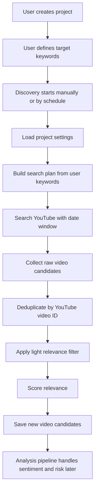

# Video Discovery Functional Requirements

Date: 2026-05-28

## Purpose

The video discovery feature helps a hardware consumer brand actively find newly published YouTube videos that may mention its brand, products, or monitored market topics. Discovery is the first stage of the monitoring system. Its job is to find relevant candidate videos with high recall. Sentiment, risk level, and alerting are handled later by the analysis pipeline.

## Problem Statement

YouTube search can miss newly published videos, return vague results, or surface videos that are not relevant to the brand. A marketing or product team needs a repeatable discovery workflow that runs from user-defined project keywords and a target publish date window, so new videos can be found before negative reviews or product risks trend.

## Goals

- Use the keywords defined by the user during project setup as the source of truth.
- Discover new YouTube videos within a user-selected or scheduled publish date window.
- Favor high recall so the system does not miss important videos.
- Apply only a light relevance filter before saving candidates.
- Deduplicate videos per project.
- Save discovered videos for later review, analysis, and alerting.
- Support both manual discovery and future scheduled monitoring using the same discovery logic.

## Non-Goals

- Discovery does not classify whether a video is good or bad.
- Discovery does not decide whether to alert the user.
- Discovery does not replace the analysis pipeline.
- Discovery does not require every configured keyword to appear in a video.
- Discovery should not use overly strict filters that hide weak but potentially important signals.

## User Inputs

The discovery system uses the project configuration already provided by the user.

- Project name
- Brand keywords
- Key products
- Markets
- Languages
- Time trigger and publish window
- Alert sensitivity

The primary discovery inputs are:

- `brand_keywords`
- `key_products`
- `markets`
- `languages`
- `time_trigger`
- `published_after`
- `published_before`

The time trigger is essential because discovery is not a general YouTube search. It is a monitored search over a specific time window.

Time trigger examples:

```text
manual_last_24h
manual_last_7d
scheduled_daily
scheduled_weekly
custom_range
```

Example:

```text
brand_keywords:
- HoverAir
- Hover Air

key_products:
- X1 Pro
- X1 Pro Max
- V-Copter

markets:
- United States
- Japan

languages:
- en
- ja

time_trigger:
- scheduled_daily

published_after:
- now - 48 hours

published_before:
- now
```

## Discovery Triggers

The same discovery logic must support two trigger types.

### Manual Discovery

The user starts discovery from the application UI.

Required behavior:

- User selects or uses a default time trigger and publish date window.
- Backend loads the selected project settings.
- Backend searches YouTube using the configured project keywords.
- Backend saves relevant candidate videos into the project queue.

### Scheduled Discovery

A future scheduler starts discovery automatically.

Required behavior:

- Scheduler runs daily or weekly per active project.
- Scheduler calls the same discovery service used by manual discovery.
- Scheduler provides the time trigger and publish date window.
- Scheduler should use an overlap window to reduce missed videos.

Recommended daily window:

```text
published_after = now - 48 hours
published_before = now
```

Reason: YouTube search can surface videos late, so exactly 24 hours is too narrow.

## Functional Flow



## Search Plan Requirements

The search plan must preserve the exact user-defined keywords.

Required behavior:

- Use each configured brand keyword and key product as a primary search seed.
- Do not combine all project keywords into one strict query.
- Exact user keywords must always be included in the generated search plan.
- Do not add localized intent or market variants in Phase 1; the project keywords and configured languages are enough.
- If more than three languages are configured, search English first when configured, plus the next two configured languages.

Bad query pattern:

```text
HoverAir Hover Air X1 Pro X1 Pro Max V-Copter review crash battery
```

This is too strict and may miss relevant videos.

Preferred query pattern:

```text
HoverAir
Hover Air
HoverAir X1 Pro
HoverAir X1 Pro Max
V-Copter
X1 Pro Max
```

## YouTube Search Requirements

For each query, the system should search YouTube with a publish window.

### Manual Discovery Source Policy

Manual discovery can use SerpAPI as a market-localized candidate source when `SERPAPI_API_KEY` is configured.

Required behavior:

- SerpAPI is a candidate source only, not canonical video metadata.
- SerpAPI search uses the exact user keyword, project language, project market, and YouTube upload-date filter.
- Each SerpAPI `video_id` must be validated and enriched through YouTube Data API `videos.list` before saving.
- Canonical publish-window filtering must use YouTube Data API `snippet.publishedAt`, not SerpAPI relative date text.
- If SerpAPI is missing, times out, or returns malformed data, discovery continues with YouTube Data API.

Scheduled Pulse monitoring does not use SerpAPI in the first build. Pulse uses YouTube Data API latest search with overlapping publish windows, then the existing analysis pipeline handles risk detection.

Required YouTube search parameters:

```text
type=video
order=date
publishedAfter=<window start>
publishedBefore=<window end>
maxResults=min(requested max_results, 50)
```

Discovery should not divide the requested origin fetch size across queries. Each query asks YouTube for the full allowed page so downstream dedupe, filtering, and final `max_results` trimming operate on enough raw candidates.

Optional parameters when available from project settings:

```text
relevanceLanguage=<project language>
regionCode=<project market>
```

Important requirement:

- `order=date` must be used for active monitoring because the feature is looking for newly published videos, not generally popular or broadly relevant videos.

## Raw Candidate Fields

Each raw candidate should include:

- YouTube video ID
- Video URL
- Title
- Description
- Channel name
- Published timestamp
- Language
- Discovery query
- Discovery source

## Deduplication Requirements

The system must deduplicate by:

```text
monitor_profile_id + youtube_video_id
```

Required behavior:

- The same YouTube video must not appear twice in the same project.
- The same YouTube video may appear in another user's project or another project.
- Duplicate results from multiple queries should be merged before persistence.

## Light Relevance Filter

Discovery should use a loose relevance filter.

Keep a video if:

- Title matches any user-defined brand keyword or key product.
- Description matches any user-defined brand keyword or key product.
- Title or description matches a known safe variant of a user-defined keyword.

Reject a video only if:

- It has no brand, product, or safe keyword-variant signal in title or description.
- It is outside the requested publish window.
- It is already saved in the same project.
- It is missing required video identity fields.

Important requirement:

- `key_products` should improve scoring, not act as a hard required filter.

Reason:

A video titled "New HoverAir drone has a serious problem" may not include the exact product name, but it can still be highly relevant.

## Relevance Scoring Requirements

After the light filter, each candidate should receive a relevance score and reason.

Scoring signals:

- Exact brand keyword match in title.
- Exact brand keyword match in description.
- Exact key product match in title.
- Exact key product match in description.
- Multiple configured keyword matches.
- Query that discovered the video.
- Publish recency.

Example:

```text
relevance_score = 0.82
relevance_reason = "Matched HoverAir in title and X1 Pro Max in description."
```

The relevance reason must be clear enough for a user to understand why the video was added.

## Persistence Requirements

When a candidate passes filtering, save it as a discovered video candidate.

Required state:

```text
queue_state = discovered
```

Discovery should not automatically mark the video as approved, analyzed, risky, or alert-worthy.

## Monitoring Scheduler Requirements

The scheduler is a trigger layer on top of discovery.

Required behavior:

- Run discovery for active projects on a configured cadence.
- Use the project keywords exactly as configured by the user.
- Use a date window with overlap.
- Deduplicate against existing project candidates.
- Record audit details for each run.

Future scheduler metadata should include:

- Last successful run time
- Last attempted run time
- Number of raw results found
- Number of candidates saved
- Number of duplicates skipped
- Number of candidates filtered out
- Error message, if the run failed

## Future Proactive Monitoring Feature

In the future, the product should add proactive monitoring on top of the same discovery pipeline.

Proactive monitoring should not create a separate discovery system. It should reuse the existing discovery flow:

```text
Project keywords + time trigger + publish window
-> YouTube discovery
-> deduplication
-> light relevance filtering
-> relevance scoring
-> candidate persistence
-> analysis
-> monitoring report
```

The difference is the output. Manual discovery adds videos to the project queue for user review. Proactive monitoring should also generate a scheduled report.

Required future behavior:

- Run daily or weekly for active projects.
- Use the same user-defined keywords, markets, languages, and time-window logic.
- Analyze newly discovered candidates after discovery.
- Generate a daily or weekly monitoring report.
- Highlight newly discovered videos, negative reviews, high-risk product issues, competitor wins, and repeated patterns.
- Notify the user when the report contains meaningful negative sentiment, high risk, or urgent product signals.
- Avoid duplicate reporting for the same video unless the risk status materially changes.

Report outputs should include:

- Discovery summary: searched window, queries used, raw results, saved candidates, duplicates, and filtered videos.
- Sentiment summary: positive, neutral, and negative video counts.
- Risk summary: low, medium, high, and critical risk counts.
- Top new risks: highest-risk videos discovered in the period.
- Notable praise: videos worth amplifying.
- Competitor signals: places where competitors outperform or are criticized.
- Recommended action: ignore, comment publicly, reach out privately, or escalate internally.

This feature should treat discovery as the intake layer and the report as the monitoring layer.

## Analysis Handoff

Discovery hands saved candidates to the later analysis workflow.

Analysis is responsible for:

- Transcript or media extraction
- Sentiment classification
- Risk level classification
- Technical failure detection
- Marketing response recommendation
- User alerting

Discovery is responsible only for:

```text
Should this video enter the project queue?
```

Analysis is responsible for:

```text
Is this video positive, neutral, negative, or risky?
```

## Alerting Handoff

The user should be reminded only after analysis determines that a video is important.

Alert candidates include:

- Negative sentiment with product evidence
- High or critical risk
- Repeatable technical failure
- Safety-related issue
- Competitor outperforming the monitored brand
- Repeated issue across multiple videos

Discovery alone should not alert the user.

## Audit And Observability Requirements

Each discovery run should record:

- Project ID
- Trigger type: manual or scheduled
- Publish window
- Search queries used
- Raw result count
- Saved candidate count
- Duplicate count
- Filtered count
- Error count

This is important because users need to understand whether the system searched correctly and why videos were or were not discovered.

## Acceptance Criteria

- Given a project with user-defined keywords, discovery searches using those keywords without requiring the user to re-enter them.
- Given multiple keywords, discovery searches them as separate or lightly combined query seeds rather than one strict combined query.
- Given a publish date window, discovery only saves videos inside that window.
- Given a newly published relevant video, discovery can save it when the keyword appears in either title or description.
- Given a duplicate YouTube video already saved in the same project, discovery does not create a second candidate.
- Given the same YouTube video in another project, discovery may save it independently for the current project.
- Given a brand-level video without an exact key product match, discovery can still save the video if the brand keyword matches.
- Given a candidate that passes discovery, the video is saved with `queue_state = discovered`.
- Given a candidate that is discovered, no sentiment, risk, or alert decision is made until analysis runs.

## Testing Requirements

Unit or API tests should cover:

- Search plan preserves exact user-defined keywords.
- Search plan does not collapse all keywords into one strict query only.
- YouTube search request includes `order=date`.
- Publish window is passed to the YouTube search request.
- Description keyword matches are kept.
- Title keyword matches are kept.
- Videos with no title or description keyword signal are filtered out.
- Key products improve scoring but are not required for keeping a candidate.
- Duplicate video IDs are not saved twice in the same project.
- The same video ID can exist in different projects.

Manual QA should cover:

- Create a project with brand keywords and key products.
- Run discovery for the last 24 hours or last 7 days.
- Confirm discovered videos explain why they matched.
- Confirm weak unrelated results are mostly filtered out.
- Confirm relevant brand-level videos are not dropped only because product name is missing.

## Product Principle

Discovery should optimize for recall.

Analysis should optimize for precision.

This means discovery may allow a few weak candidates into the queue, but it should avoid missing videos that could become important product or marketing risk signals.
